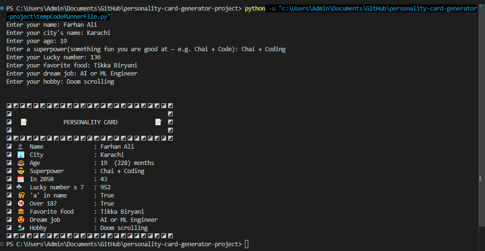

# 😎 personality-card-generator-project

A command-line personality card generator built in **Python** — my **second** project for the **Code to AI** course! 🚀

It asks the user for 8 inputs and instantly generates a card.


## 🧠 Concepts I used

* **Comments**
* **Variables**
* **User input with `input()`**
* **Type casting / type conversion with `int()`**
* **Strings**
* **Integers / numeric values**
* **Arithmetic operations (`+`, `-`, `*`)**
* **Output using `print()`**
* **f-strings**
* **Boolean values (`True/False`)**
* **Membership operator (`in`)**
* **Comparison operator (`>`)**
* **Using expressions inside f-strings**

## **💻 User inputs:**

* **Name**
* **City**
* **Age**
* **Superpower**
* **lucky number**
* **favorite food**
* **dream job**
* **hobby**

## 🔥Then it spice up some things

* It **calculates** your **age in months**
* It **calculates**, how **old** you will be in **2050**
* It **multiplies** your **lucky number with 7**
* It **seaches** for letter **'a'** in your **name** and returns **True and False**
* It also **checks** whether you are **older** then **18 years** or not and **return True and False**

## ▶️ How to run

1. Make sure **Python** is installed.
2. Download or clone this repo.
3. Open a terminal in the project folder and run:

```bash
Personality_card_Generator.py
```

4. Type inputs when asked — and see the magic! ✨


## 📸 Example




## 👨‍💻 Author

Built by **Farhan Ali** as part of the **Code to AI — Python & Data Science** course.

> From Code to AI — let's build the future together. 🐍🚀
>
